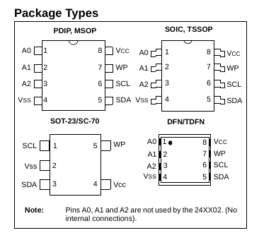
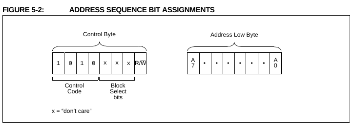
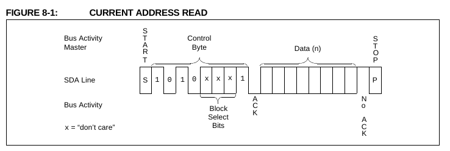

# Разбор в работы EEPROM на примере 24LC02B

## Содержание

1. [EEPROM: Описание и назначение]()
2. [Характеристики EEPROM 24LC02B]()
3. [Операции над EEPROM: введение]()
4. [Адресация]()
5. [Страничный буфер]()
6. [Защита записи]()
7. [Операции над EEPROM: подробное описание]()

***

## EEPROM: Описание и назначение

**Electrically Erasable Programmable Read-Only Memory**

**Электрически стираемое перепрограммируемое запоминающее устройство (ПЗУ)**

Программируя на микроконтроллере **STM32F0**, вам скорее всего не раз хотелось сохранить *настройки* или *логи* выполнения своей программы, ведь оперативная память **STM32F0** затирается каждый раз при отключении питания. Решением этой проблемы служат *внешние носители информации*, представителем которых и являются [EEPROM](https://ru.wikipedia.org/wiki/EEPROM "Статья на Википедии").

На самом деле, **EEPROM** имеют довольно узкую специализацию. Наибольший размер у них составляет 256 кбайт (**24LCM02**), и этого обычно недостаточно, чтобы хранить большие объемы данных — для этого используются другие виды памяти. Зато есть параметр, по которым EEPROM имеет значительное преимущество перед остальными — ***количество перезаписей***, составляющее около миллиона раз. Для готовых к выпуску устройств это очень важно, так как никому не захочется менять один чип в уже собранном приборе, сломавшийся из-за слишком долгой эксплуатации. Для этих целей и используют **EEPROM**: хранят на них либо логи, для которых не нужен большой объем, либо настройки, объем которых и того меньше.

> Примечание: Информация о штатной работе нужна редко, в логах хранятся сведения о возникающих ошибках. Так же их нет смысла хранить за долгий промежуток. Однако длительность этого промежутка, естественно, зависит от того, что делает само устройство.

***

## Характеристики **EEPROM** 24LC**02**B

Разберем конкретную модель **EEPROM** — **24LC02B**. Самым полным источником информации по любому чипу всегда является [документация](https://www.microchip.com/wwwproducts/en/24LC02B) от производителя. Извлечем оттуда интересующую нас на данный момент информацию:

- **Напряжение питания**: 2,5 — 5,5 Вольт. Следовательно, можно подключать 24LC02B как на выход +3V, так и на +5V.
- **Интерфейс**: I2C. Даже если вы забыли, как реализовывать этот протокол, в документации часто есть его описание.
- **Запись страницы**: 3 мс (однако максимум - 5).
- **Страничный буфер**: 8 байт.
- **Аппаратная защита записи**.
- **Более 1 миллиона циклов перезаписей**.

Из документации же узнаем о распиновке чипа, находим наш корпус (**PDIP**, при подключении обратите внимание на выемку):

Здесь:

- A0-2 — дополнительные контакты адресации (если на шине 1 устройство такого типа, их все нужно заземлить и в контрольном байте считать [x][x][x] = [0][0][0]);
- Vss — земля;
- Vcc — питание;
- WP — пин, устанавливающий защиту записи: 1=вкл, 0=выкл;
- SCL и SDA — собственно шина I2C.

***

## Операции над EEPROM: введение

Бегло перечислим список операций над **EEPROM**:

- Запись одного байта по адресу;
- Запись N байт по адресу;
- Чтение текущего байта;
- Чтение одного байта по адресу;
- Чтение N байт по адресу.

В конце мы более тщательно разберем каждую из них, а пока перейдем к тонкостям запросов I2C. Путешествуя по документации, находим необходимые данные устройства, а именно его *код* и *устройство контрольного байта*:

Скорее всего, вас смутило то, что 7 бит поделены на 2 части, из которых коду устройства отведено всего лишь 4. Дело в том, что несколько **EEPROM** можно располагать на одной I2C шине, до 2^3=8 штук, тем самым образуя одну большую память.

***

## Адресация

Разберемся, наконец, с адресацией внутри одной **EEPROM**.

Как видно, за отправкой контрольного байта следует отправка байта адресации. Адресация побайтовая. Память **EEPROM** разбита на страницы, размер которых в байтах можно найти в документации (см: страничный буфер).
Рассмотрим **EEPROM** 24LC**02**:

- Память нашего EEPROM: 2 кбит = 2^8 байт, следовательно, для полной адресации достаточно 8 бит = 1 байта, что мы и наблюдаем.
- Осталось: 3 бита (из контрольного байта) => на шине может находиться до 2^3=8 EEPROM с таким же кодом.

Рассмотрим другой **EEPROM** 24LC**16**:

- Память EEPROM: 16 кбит (теперь должно быть понятно, что значат цифры на конце маркировки чипа) = 2 кбайт = 2^11 байт, следовательно, достаточно 11 бит…

***А доступно 8***. Нужные 3 бита берут из контрольного байта, из чего следует, что на шине I2C может быть только одна **EEPROM** 24LC**16**. Итак, все 3+8=11 бит, часть из которых занята у контрольного байта, используются для адресации внутри ***одного*** **EEPROM**.

Очевидно, что на I2C шине может быть два 24LC**08** или четыре 24LC**04**. Учитывая, адресация по устройствам не может использовать свободные биты из байта адресации, так же очевидно, что хоть 24LC**01** и использует 7 бит из байта адресации, на шине их не может быть больше 2^3=8.

Заметим, что для **EEPROM** большего размера (24LC**32**-**512**, 24LC**M01** и 24LC**M02**) вместо одного байта адресации отправляется два.

***

## Страничный буфер

Перейдем к понятию страницы **EEPROM**. Дело в том, что память в **EEPROM** можно разбить на некоторые участки одинакового размера, которые и называют *страницами*. В нашем случае при объеме 256 байт и размере страницы (т. е. страничного буфера) 8 байт получаем, что их 32.

Не будет сюрпризом, что запись в **EEPROM** не моментальна. Соответственно, между запросами на запись в **EEPROM** не должно пройти меньше времени, чем указанное в документации (в нашем случае, 3 миллисекунды (помним, что лучше пропустить 5)).

Разбиение памяти на страницы позволяет ускорить процесс записи. Именно с этой целью был введен *страничный буфер* (внутри **EEPROM**). Теперь мы знаем, что объем данных в запросе на запись не может быть больше, чем объем страничного буфера. Итак, в нашем случае мы можем записать одним запросом от 1 до 8 байт.

Но и тут не все так гладко. К примеру, если указанный в запросе адрес приходится на внутреннюю часть страницы (например, запись по адресу 13), а требуемый объем данных — 8 байт (размер страницы) будет ситуация **Undefined Behavior** — **EEPROM** может не записать запрос, может записать куда надо, может записать куда не надо — а узнать об этом будет невозможно.

> Однако в качестве проверки можно сразу после записи данных считать их же — это займет больше времени, зато значительно повысит надежность.

Подведем итоги: запись из N байт по адресу A будет успешной, если *адрес A + N принадлежит той же, странице, что и адрес A*.

***

## Защита записи

Для чего нужна *защита записи* — **WP**? Включенная защита гарантирует то, что никакой запрос на запись не будет записывать, а запросы на чтение будут выполняться как обычно. Будет проваливаться именно *запись в память* — устройству, отправляющему запросы, будет *казаться*, что все данные успешно записаны. Такая система позволяет гарантировать сохранность настроек при работе готового устройства. При правильном написании программы можно избежать одновременной записи в одну **EEPROM**.

> В параллельном программировании **EEPROM** называлась бы **критической областью**, а WP при правильном применении — **мьютексом**. Соответственно, неплохо будет по умолчанию держать защиту включенной, снимать перед записью и снова устанавливать после. Если не хотите пользоваться этой функцией, нужно ***заземлить WP*** (постоянный 0).

***

## Операции над **EEPROM**: подробное описание

Познав специфику адресации **EEPROM**, вернемся к операциям.

### Запись одного байта по адресу

1. (Если используем защиту записи, WP := 0)
2. **START**;
3. Контрольный байт = «1010» (код устройства) + [x][x][x] (биты адресации между несколькими устройствами) + 0 (Write);
4. **ACK**;
5. 1 байт (или 2 байта разделяемые **ACK**) адресации собственно внутри EEPROM;
6. **ACK**;
7. Собственно байт, который хотим записать.
8. **ACK**;
9. **STOP**;
10. (Если используем защиту записи, WP := 1)
11. Ждем, пока данные записываются (в нашем случае 5 миллисекунд).

### Запись N байт по адресу

1. (Если используем защиту записи, WP := 0)
2. **START**;
3. Контрольный байт = «1010» (код устройства) + [x][x][x] (биты адресации между несколькими устройствами) + 0 (Write);
4. **ACK**;
5. 1 байт (или 2 байта разделяемые **ACK**) адресации собственно внутри EEPROM;
6. **ACK**;
7. Собственно байты, который хотим записать, разделяемые **ACK** — см правила записи нескольких байт.
8. **ACK**;
9. **STOP**;
10. (Если используем защиту записи, WP := 1)
11. Ждем, пока данные записываются (в нашем случае 5 миллисекунд).

### Чтение текущего байта

1. **START**;
2. Контрольный байт = «1010» (код устройства) + [x][x][x] (биты адресации между несколькими устройствами) + 1 (Read);
3. **ACK**;
4. EEPROM посылает байт.
5. **NO ACK**;
6. **STOP**.

Важно уточнить, что вообще значит *«текущий адрес»*. Это есть адрес байта, доступ к которому выполнился *самым последним*. Будь то запись или чтение, все операции изменяют этот текущий адрес.

Например, если сначала вызвали **READ(42)**, а потом **READ_CURRENT()**, то последняя операция вернет значение 43-го байта памяти.

Если в точности повторить этот набор операций еще раз, **READ_CURRENT()** снова вернет значение 43-го байта памяти, так как **READ(42)** изменит текущий адрес.

Если еще раз вызвать **READ_CURRENT()**, операция вернет значение 44-го байта памяти.

### Чтение одного байта по адресу

1. **START**;
2. Контрольный байт = «1010» (код устройства) + [x][x][x] (биты адресации между несколькими устройствами) + ***0 (Write)***;
3. **ACK**;
4. 1 байт (или 2 байта разделяемые **ACK**) адресации собственно внутри EEPROM;
5. **ACK**;
6. **START**;
7. Контрольный байт = «1010» (код устройства) + [x][x][x] (биты адресации между несколькими устройствами) + ***1 (Read)***;
8. **ACK**;
9. EEPROM посылает байт.
10. **NO ACK**;
11. **STOP**.

В документации эта операция называется **«Random Read»**. Правильный перевод **«чтение по произвольному адресу»**.

### Чтение N байт по адресу

1. **START**;
2. Контрольный байт = «1010» (код устройства) + [x][x][x] (биты адресации между несколькими устройствами) + ***0 (Write)***;
3. **ACK**;
4. 1 байт (или 2 байта разделяемые **ACK**) адресации собственно внутри EEPROM;
5. **ACK**;
6. **START**;
7. Контрольный байт = «1010» (код устройства) + [x][x][x] (биты адресации между несколькими устройствами) + ***1 (Read)***;
8. **ACK**;
9. EEPROM посылает байты. После каждого приема нужно отправить **ACK**, а **NO ACK** будет значить, что нам достаточно полученного.
10. **NO ACK**
11. **STOP**.

Зиновчик Олег, ФРТК 2019

Версия β0.3
